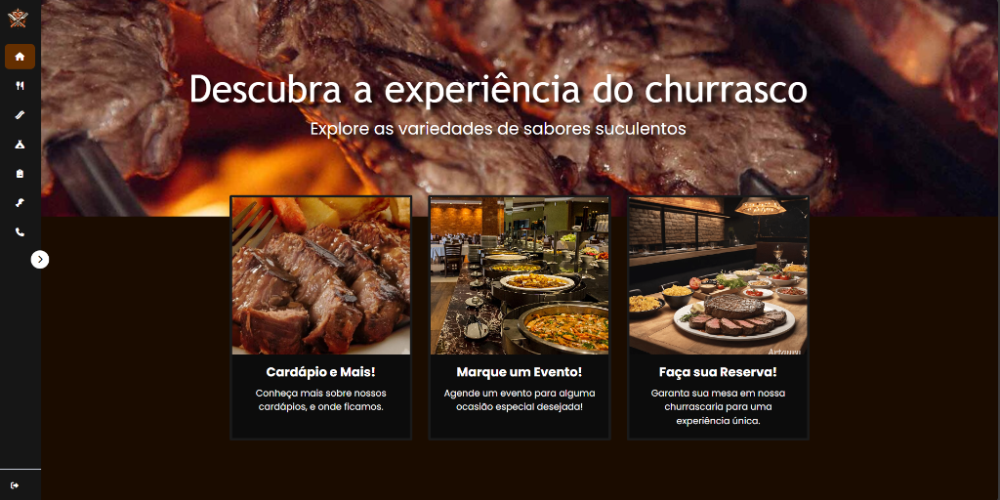
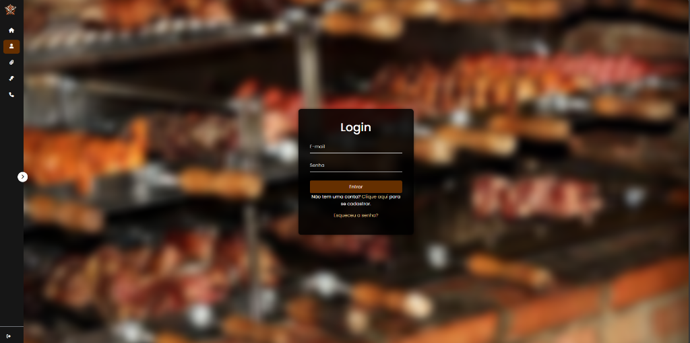
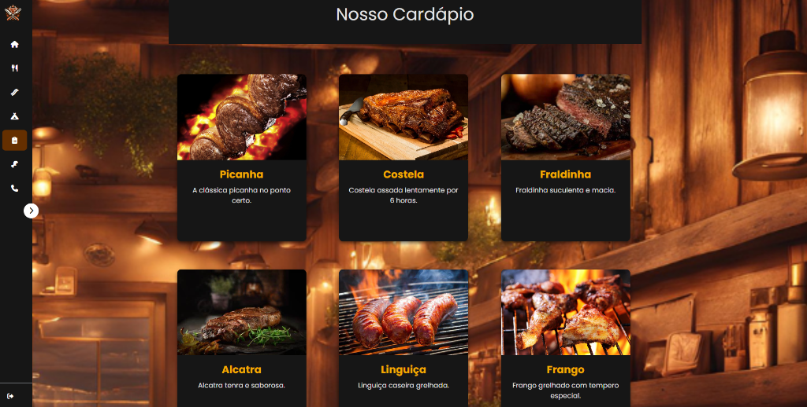
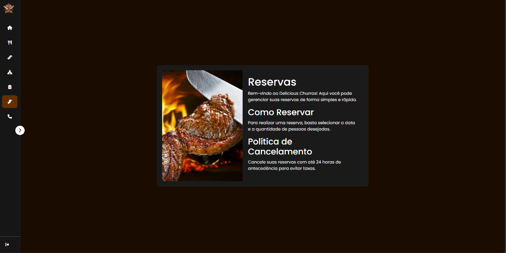
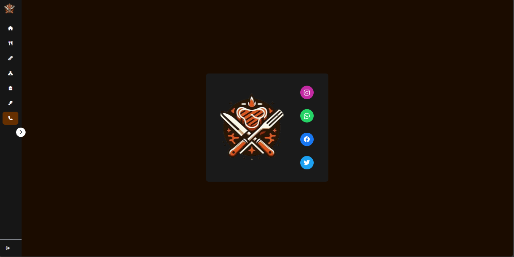

<div align="center">


# 🥩 Delicious Churras — Portal Web de Churrascaria

> **Sistema web completo para gestão e experiência digital de uma churrascaria.**  
> Desenvolvido como Trabalho de Conclusão de Curso (TCC), oferece ao cliente uma plataforma para reservas, agendamento de eventos e visualização do cardápio, e ao administrador um painel robusto de gerenciamento.

[](https://www.php.net/)
[](https://www.sqlite.org/)
[](https://getbootstrap.com/)
[](https://developer.mozilla.org/pt-BR/docs/Web/JavaScript)
[](https://developer.mozilla.org/pt-BR/docs/Web/CSS)
[](https://github.com/PHPMailer/PHPMailer)

</div>

---

## 📸 Screenshots

<div align="center">

### 🏠 Página Inicial — Home
*Banner imersivo com acesso rápido ao cardápio, eventos e reservas*



---

### 🔐 Autenticação — Login
*Tela de login com fundo fotográfico e recuperação de senha por e-mail*



---

### 🥩 Nosso Cardápio
*Galeria visual dos pratos com fundo temático de churrascaria*



---

### 📅 Reservas
*Módulo completo de reserva de mesas com política de cancelamento*



---

### 📞 Contato
*Página de contato com links para redes sociais (Instagram, WhatsApp, Facebook, Twitter)*



</div>

---

## 🚀 Funcionalidades

### 👤 Área do Cliente
| Funcionalidade | Descrição |
|---|---|
| 🔐 **Login / Cadastro** | Autenticação segura com sessão PHP |
| 🔑 **Recuperação de Senha** | Fluxo completo via e-mail com PHPMailer |
| 🥩 **Cardápio** | Visualização de pratos com imagens e descrições |
| 📅 **Reservas de Mesa** | Agendamento com seleção de data, horário e número de pessoas |
| 🏕️ **Eventos** | Listagem e agendamento de eventos especiais |
| 📋 **Minhas Reservas** | Histórico e gerenciamento das próprias reservas |
| 📆 **Meus Agendamentos** | Acompanhamento dos eventos agendados |
| ℹ️ **Sobre Nós** | Apresentação institucional da churrascaria |
| 📞 **Contato** | Links para redes sociais e formas de contato |

### 🛠️ Painel Administrativo (`/admin`)
| Módulo | Operações |
|---|---|
| 👥 **Clientes** | Listar, Registrar, Editar, Apagar |
| 🏪 **Estabelecimentos** | Listar, Registrar, Editar, Apagar |
| ⏰ **Horários** | Listar, Registrar, Editar, Apagar |
| 📅 **Reservas** | Listar, Registrar, Editar, Apagar |
| 🏕️ **Eventos** | Listar, Registrar, Editar, Apagar |
| 📆 **Agendamentos** | Listar, Registrar, Editar, Apagar |
| 🖼️ **Imagens** | Listar, Upload, Editar, Visualizar, Apagar |

---

## 🛠️ Tecnologias Utilizadas

| Camada | Tecnologia | Versão |
|---|---|---|
| **Backend** | PHP | 8.x |
| **Banco de Dados** | SQLite (via PDO) | 3.x |
| **E-mail** | PHPMailer | ^6.9 |
| **Frontend** | HTML5 + CSS3 Vanilla | — |
| **Framework CSS** | Bootstrap | 4.1.3 |
| **Interatividade** | JavaScript (ES6) | — |
| **Ícones** | Font Awesome | 6.5.1 |
| **Tipografia** | Google Fonts — Roboto | — |
| **Servidor Local** | PHP Built-in Server + Python | — |

---

## 📁 Estrutura do Projeto

```
htdocs/
│
├── 📄 index.php                  # Página inicial (Home)
├── 📄 login.php                  # Tela de login
├── 📄 cadastrar.php              # Cadastro de novo usuário
├── 📄 sair.php                   # Logout / Encerrar sessão
├── 📄 resetar_senha.php          # Solicitar redefinição de senha
├── 📄 nova_senha.php             # Formulário de nova senha
├── 📄 cardapio.php               # Visualização do cardápio
├── 📄 reservas.php               # Fazer reserva de mesa
├── 📄 minhas_reservas.php        # Reservas do cliente logado
├── 📄 eventos.php                # Listagem de eventos
├── 📄 agendar_evento.php         # Agendar um evento
├── 📄 meus_agendamentos.php      # Agendamentos do cliente
├── 📄 sobre_nos.php              # Sobre a churrascaria
├── 📄 contato.php                # Página de contato
├── 📄 conectar.php               # Conexão PDO com SQLite
├── 📄 mailer.php                 # Configuração do PHPMailer
│
├── 📁 admin/                     # Painel Administrativo (acesso restrito)
│   ├── sistema.php               # Dashboard do sistema
│   ├── registrar_*.php           # Listagem de cada entidade
│   ├── editar_*.php              # Edição de registros
│   ├── apagar_*.php              # Remoção de registros
│   └── salvar_*.php             # Persistência de dados
│
├── 📁 css/                       # Estilos por página/componente
├── 📁 js/                        # Scripts de validação e interação
├── 📁 img/                       # Imagens estáticas do site
├── 📁 img_banco/                 # Imagens de eventos (upload)
├── 📁 docs/screenshots/          # Capturas de tela do projeto
│
├── 📄 composer.json              # Dependências PHP (PHPMailer)
├── 📄 run.sh                     # Script de inicialização do servidor
└── 📄 LocalServer.py             # Servidor local Python auxiliar
```

---

## ⚙️ Como Executar Localmente

### Pré-requisitos
- PHP 8.x instalado
- Composer instalado
- Git

### Passos

```bash
# 1. Clone o repositório
git clone git@github.com:ViniciusRuby/ChurrascariaSite.git
cd ChurrascariaSite

# 2. Instale as dependências PHP
composer install

# 3. Inicie o servidor embutido do PHP
php -S localhost:8000

# 4. Acesse no navegador
# http://localhost:8000
```

> **Alternativa:** Execute o script `run.sh` diretamente:
> ```bash
> chmod +x run.sh && ./run.sh
> ```

---

## 🔐 Controle de Acesso

O sistema possui dois tipos de usuário:

| Tipo | Acesso | Identificador |
|---|---|---|
| **Cliente** | Páginas públicas + área do cliente | `tipo = 'C'` |
| **Administrador** | Painel `/admin` completo | `tipo = 'A'` |

> Tentativas de acesso não autorizado ao painel admin redirecionam para `acesso_negado.php`.

---

## 📧 Configuração de E-mail (PHPMailer)

O sistema utiliza **PHPMailer** para o fluxo de recuperação de senha. Configure as credenciais SMTP no arquivo `mailer.php`:

```php
$mail->Host       = 'smtp.seuservidor.com';
$mail->Username   = 'seu@email.com';
$mail->Password   = 'sua_senha';
$mail->Port       = 587;
```

---

## 🗄️ Banco de Dados

O projeto utiliza **SQLite** como banco de dados local, armazenado no arquivo `tcc.db` (ignorado pelo `.gitignore` por conter dados locais).

A conexão é gerenciada em `conectar.php` com as seguintes configurações:
- **PDO** com modo de erro por exceções
- **Foreign Keys** habilitadas via `PRAGMA`
- **Busy timeout** de 5 segundos para concorrência

---

## 👨‍💻 Autor

**ViniciusRuby**  
[](https://github.com/ViniciusRuby)

---

<div align="center">

*Desenvolvido com ❤️ e muito churrasco 🥩*

</div>
